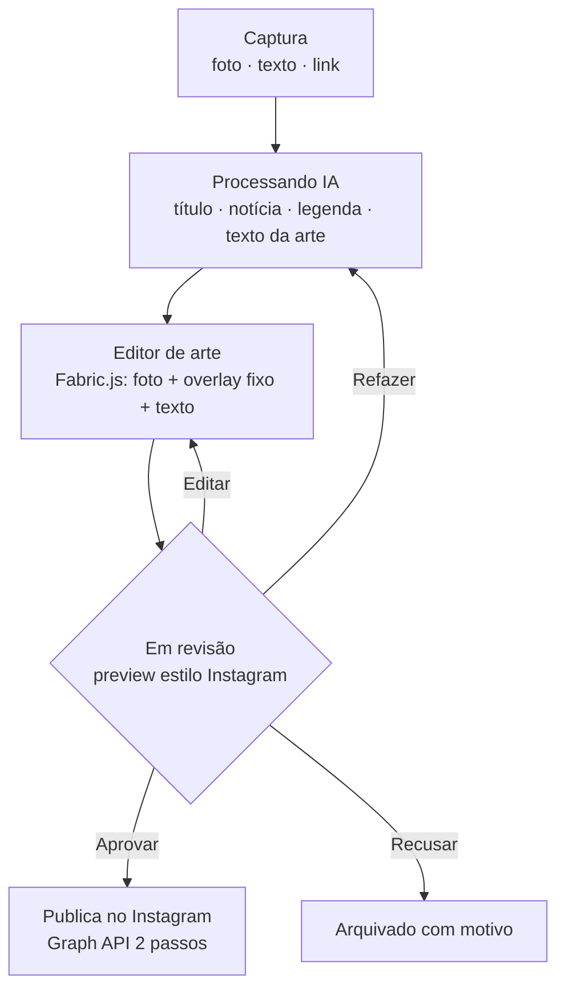

<div align="center">

# JornIA

**Da fonte ao feed em minutos.** Publicação rápida de notícias no Instagram para redações de jornal — a IA redige o texto, o jornalista ajusta a arte e o editor aprova antes de publicar.

[](LICENSE)
[](https://nextjs.org/)
[](https://www.typescriptlang.org/)
[](https://www.postgresql.org/)
[](https://www.prisma.io/)

</div>

> **TL;DR (EN):** JornIA is an open-source newsroom tool to publish breaking‑news posts to Instagram fast. A journalist drops in a source (photo, text, or link); AI drafts the copy (headline, short news, caption, on‑art text); the journalist fits the photo into a fixed brand template; an editor reviews (approve / reject / regenerate / edit) and only then it goes live via the Instagram Graph API. Every cycle creates a new version, so you get history and audit for free.

---

## ✨ O que é

Uma ferramenta web para uma redação publicar posts **urgentes** no feed do Instagram com o **mínimo de fricção**:

1. **Captura** — o jornalista manda a fonte: uma foto, um texto pronto ou um link.
2. **IA (só texto)** — o sistema gera **título**, **notícia curta**, **legenda** e o **texto sugerido da arte**.
3. **Editor de arte** — o próprio jornalista ajusta a foto (posição/zoom) e o texto dentro de um **template fixo da marca**.
4. **Revisão** — um editor/gerente vê um **preview estilo Instagram** e decide: **aprovar**, **recusar**, **refazer com IA** ou **editar** manualmente.
5. **Publicação** — ao aprovar, o post vai direto pro Instagram via **Graph API** (fluxo de 2 passos).

> **Não é** agendador (publicação é imediata, sob demanda). **Não gera imagem por IA** — a arte é sempre uma foto real sobre um overlay fixo. **Só feed do Instagram** por enquanto (Stories/vídeo/multi‑rede ficam para uma v2).

## 🔄 O fluxo



Cada ciclo (IA ou edição manual) gera uma **nova versão**, nunca sobrescreve — histórico e auditoria de graça.

## 🧱 Stack

| Camada | Tecnologia |
|---|---|
| Frontend | **Next.js 15** (App Router, React 19), Tailwind CSS |
| Editor de arte | **Fabric.js 6** (canvas: foto arrastável/zoom, overlay travado, texto) |
| Render final | **Sharp** (server-side, a partir dos parâmetros salvos — não do canvas) |
| Backend | Next.js API Routes |
| Banco | **PostgreSQL** + **Prisma** |
| IA (texto) | Abstração de provider — **Anthropic (Claude)** por padrão, ou `mock` para dev |
| Storage | Abstração — **local** (dev) ou **S3 / Cloudflare R2 / Supabase** |
| Publicação | **Instagram Graph API** (Meta), sem libs de terceiros |
| Auth | Sessão própria com JWT (`jose`) + `bcrypt`, papéis por RBAC |

## 🚀 Começando

Pré-requisitos: **Node 20+** e **PostgreSQL** (ou Docker).

```bash
# 1. Instalar dependências
npm install

# 2. Configurar ambiente
cp .env.example .env
#   Para testar sem nenhuma chave externa, use no .env:
#     AI_PROVIDER=mock
#     STORAGE_PROVIDER=local

# 3. Subir o Postgres (opcional, via Docker)
docker compose up -d

# 4. Criar as tabelas e popular dados iniciais
npm run db:migrate      # cria as migrations do schema
npm run db:seed         # admin + exemplos + template padrão

# 5. Rodar
npm run dev             # http://localhost:3000
```

Sem Docker? Basta apontar `DATABASE_URL` no `.env` para o seu Postgres e usar `npm run db:push` no lugar do migrate.

### Credenciais do seed

| Papel | E-mail | Senha |
|---|---|---|
| Admin | `admin@jornia.local` | `admin12345` |
| Editor/Gerente | `editor@jornia.local` | `editor12345` |
| Jornalista | `reporter@jornia.local` | `reporter123` |

> Com `AI_PROVIDER=mock` e `STORAGE_PROVIDER=local` você percorre **todo o fluxo** (captura → IA → arte → render → revisão) sem configurar nada externo. Para publicar de verdade no Instagram, preencha as variáveis `IG_*`.

## 👥 Papéis

| Papel | Permissões |
|---|---|
| **admin** | Tudo — usuários, API keys, templates, style reference, aprovar/publicar |
| **manager** (editor/gerente) | Aprovar/recusar/refazer/editar/publicar; editar style reference e templates |
| **staff** (jornalista) | Envia fontes e edita as próprias submissões antes da aprovação; não aprova nem publica sozinho |

## 🔌 API

```
POST   /api/posts                                   cria post + dispara IA (texto)
GET    /api/posts                                   listagem (?status=&mine=1)
GET    /api/posts/:id                               detalhe (versões, decisões, publicações)
POST   /api/posts/:id/art                           salva photo_transform + art_text -> render (Sharp)
POST   /api/posts/:id/regenerate                    novo ciclo de IA (nova versão)
PATCH  /api/posts/:id/versions/:vid                 edição manual (nova versão)
POST   /api/posts/:id/versions/:vid/approve         aprova e publica no Instagram
POST   /api/posts/:id/versions/:vid/reject          recusa (motivo obrigatório)
POST   /api/upload                                  upload de mídia -> URL pública

GET/PUT   /api/style-reference                       exemplo de estilo usado pela IA
GET/POST  /api/art-templates                         templates fixos da marca
GET/POST  /api/users   ·  PATCH /api/users/:id       admin
GET/POST  /api/api-keys ·  DELETE /api/api-keys/:id  admin
```

## 📸 Instagram Graph API

Publicação em 2 passos: `POST /{ig-user-id}/media` (com `image_url` da arte + `caption`) → `creation_id`, depois `POST /{ig-user-id}/media_publish`.

Requisitos: conta **Instagram Business/Creator** vinculada a uma Página do Facebook, app no [developers.facebook.com](https://developers.facebook.com), conta adicionada como **Instagram Tester**. Como só se publica na **própria** conta, o app pode rodar em **modo de desenvolvimento** — sem App Review. Permissão: `instagram_business_content_publish`. Limite: 100 posts/24h por conta.

## 🗂️ Estrutura

```
src/
├── app/
│   ├── api/            rotas (posts, auth, upload, admin…)
│   ├── login/          tela de login
│   ├── dashboard/      feed de pautas
│   ├── capture/        nova pauta (foto/texto/link)
│   ├── posts/[id]/     editor de arte + revisão + histórico
│   └── admin/          usuários, API keys, templates, style reference
├── components/         ArtEditor (Fabric), InstagramPreview, AppShell…
├── lib/
│   ├── ai/             abstração de provider (Anthropic, mock) + prompt
│   ├── render/         render final com Sharp + geometria dos slots
│   ├── services/       pipeline do post (state machine)
│   ├── instagram.ts    cliente Graph API
│   ├── storage.ts      local / S3
│   ├── scrape.ts       extração de conteúdo de links
│   ├── auth.ts         senhas, sessão, API keys
│   └── rbac.ts         permissões por papel
└── middleware.ts       proteção de rotas
prisma/
├── schema.prisma       modelo do banco
└── seed.ts             dados iniciais
```

## 🗺️ Roadmap

- [ ] Stories, carrossel e vídeo (Reels)
- [ ] Multi-rede (X/Threads/Facebook)
- [ ] Provider de IA OpenAI/Gemini plugável (a interface já existe)
- [ ] Biblioteca de templates com editor visual de slots
- [ ] Métricas de publicação e fila de reprocessamento
- [ ] Autenticação de máquina via API keys (o modelo já existe no schema)

## 🤝 Contribuindo

PRs são bem-vindos! Rode `npm run typecheck && npm run lint && npm run build` antes de abrir. Veja o [SPEC.md](SPEC.md) para o contexto e as decisões de produto já validadas.

## 📄 Licença

[MIT](LICENSE) — use, modifique e distribua livremente.
